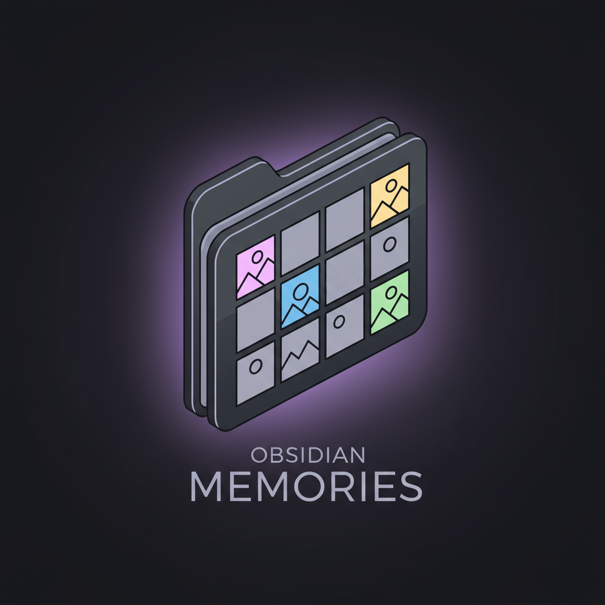
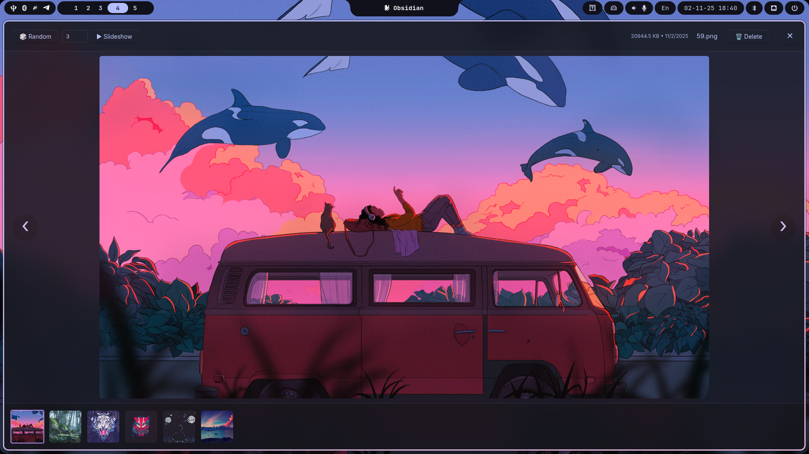
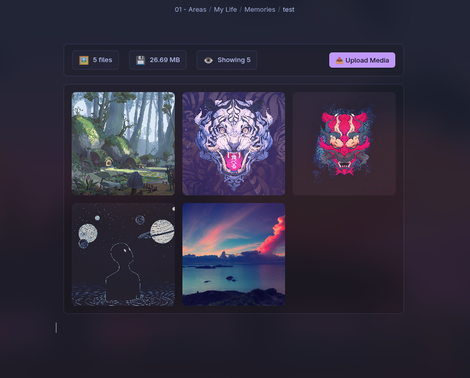

<div align="center">
	
	<h1>Memories</h1>
	<a href="https://github.com/DIMFLIX/obsidian-memories/issues">
		
	</a>
	<a href="https://github.com/DIMFLIX/obsidian-memories/stargazers">
		
	</a>
	<a href="./LICENSE">
		
	</a>
	<br>
	<br>
	<a href="./README.ru.md">
		
	</a>
	<a href="./README.md">
		
	</a>
</div>
<br>
<br>


**Memories** is a powerful plugin for Obsidian that transforms your media files into beautiful interactive galleries right inside your notes. View images, videos, and audio with support for fullscreen mode, slideshows, and advanced navigation features.


## ✨ Features

### 🎨 Flexible Display
- **Responsive grid** — automatic layout for any screen size
- **Two display modes** — full and compact
- **Customizable size** — control grid element size
- **Lazy loading** — performance optimization for large collections
- **📤 Built-in file manager** — upload and delete media directly from the gallery

### 🔍 Advanced Lightbox
- **Image zoom** — zoom with panning support
- **Multimedia support** — images, videos, and audio files
- **Interactive thumbnails** — quick navigation through the collection
- **Keyboard shortcuts** — full keyboard control

### ⚡ Smart Features
- **Auto slideshow** — automatic switching with customizable interval
- **Random mode** — random media navigation
- **Flexible sorting** — by date, name, or random order
- **Thumbnail caching** — fast loading for video files

### 📁 Universal Sources
- **Multiple paths** — media from multiple folders simultaneously
- **Recursive search** — scanning all nested folders
- **Root access** — display all vault media files


<h2>🌌 Visual Overview</h2>
<table align="center">
  <tr>
    <td colspan="4"></td>
  </tr>
  <tr>
    <td colspan="1"></td>
    <td colspan="1"></td>
  </tr>
</table>

## 📦 Installation

### Method 1: Via Community Plugins (recommended)
1. Open **Settings** → **Community plugins**
2. Disable **Restricted mode** if enabled
3. Click **Browse** and search for **"Memories"**
4. Click **Install**, then **Enable**

### Method 2: Manual Installation
1. Download the latest version from [releases](https://github.com/DIMFLIX/obsidian-memories/releases)
2. Create a folder `memories` in `.obsidian/plugins/` of your vault
3. Extract the files into the created folder
4. Reload Obsidian and activate the plugin in settings

## 🚀 Usage

### Basic Syntax
Create a code block with type `memories` in your note:

````markdown
```memories
paths: Photos/
sort: date-desc
type: compact
limit: 9
```
````

### Full Configuration

````markdown
```memories
paths: Photos/Vacation, Photos/Family
sort: date-desc
type: full
size: 250
lazy: true
limit: 12
```
````

## ⚙️ Configuration Parameters

### 📍 Specifying Paths
**Single folder:**
```yaml
paths: Photos/Vacation
```

**Multiple folders:**
```yaml
paths: Photos/Vacation, Photos/Family, Media/Videos
```

**All media from vault:**
```yaml
paths: ./
```

### 🔄 Sorting
```yaml
sort: date-desc
```
**Available options:**
- `date-desc` — by date (newest first) ⏰
- `date-asc` — by date (oldest first) 🕰️  
- `name-asc` — by name (alphabetical) 🔤
- `random` — random order 🎲

### 🎯 Display Modes
**Full gallery:**
```yaml
type: full
```
Displays all media files in the selected folders.

**Compact mode:**
```yaml
type: compact
limit: 6
```
Shows a limited number of files with the ability to view all in lightbox.

### ⚡ Performance
```yaml
lazy: true
size: 200
```
- `lazy` — lazy loading for performance optimization
- `size` — grid element size in pixels

## 🎮 Lightbox Controls

### ⌨️ Keyboard Shortcuts
- **← / →** — previous/next media
- **Space** — start/stop slideshow
- **Esc** — close lightbox
- **Mouse wheel** — navigate through media

### 🖱️ Image Controls
- **Left click** — zoom in (up to 5x)
- **Right click** — zoom out
- **Wheel on image** — smooth zooming
- **Drag** — panning when zoomed

### 🎪 Additional Features
- **🎲 Random** — random navigation through collection
- **▶️ Slideshow** — automatic slideshow (interval 1-60 sec)
- **📊 Information** — file size and modification date
- **📁 Open in explorer** — quick file access

## 🎨 Supported Formats

### 🖼️ Images
- **Basic:** JPG, JPEG, PNG, GIF, BMP, SVG, WebP
- **Extended:** TIFF, TIF, AVIF, HEIC, HEIF, ICO

### 🎥 Video
- **Modern:** MP4, WebM, OGV, MOV
- **Classic:** AVI, MKV, FLV, WMV, 3GP, M4V
- **Professional:** MPG, MPEG, M2V, ASF

### 🎵 Audio
- **Popular:** MP3, WAV, FLAC, OGG, AAC, M4A
- **Specialized:** WMA, Opus, AIFF, AU

## ⚡ Performance

### 🚀 Optimizations
- **Lazy loading** — elements load as you scroll
- **Thumbnail caching** — fast previews for video files
- **Virtualization** — efficient display of large collections
- **Intelligent observation** — Intersection Observer for smooth operation

### 📊 Recommendations
- Use `lazy: true` for galleries with more than 20 items
- Optimal `size` is 200-300 pixels for balance between detail and performance
- Compact mode (`type: compact`) for quick viewing of large collections

## 🐛 Troubleshooting

### 🔍 Gallery Not Displaying
- Check the folder path is correct
- Ensure the folder contains supported media files
- Verify the code block syntax

### 🎥 Videos Not Playing
- Ensure the format is supported by your browser
- Check video file integrity
- For problematic formats, use MP4 as a universal option

### ⚡ Slow Loading
- Enable lazy loading: `lazy: true`
- Use compact mode for large collections
- Ensure video thumbnails are cached

### 🔧 Technical Diagnostics
- Open developer console (Ctrl+Shift+I) to view errors
- Check file access permissions
- Ensure the plugin is activated in settings

## 🤝 Support and Development

### 📝 Bug Reports
Found a bug? [Create an issue](https://github.com/DIMFLIX/obsidian-memories/issues) with detailed description:
- Steps to reproduce
- Expected and actual behavior
- Obsidian and plugin version

### 💡 Feature Suggestions
Have an idea for improvement? We welcome suggestions! Describe:
- What problem your suggestion solves
- Specific implementation option
- Usage examples

### 🌟 Support the Project
- ⭐ Star on GitHub
- 📢 Share about the plugin on social media
- 💻 Participate in development through PRs

## 📄 License
The plugin is distributed as an open-source project under the [MIT license](./LICENSE).

---

<div align="center">

**Made with ❤️ for the Obsidian community**

[⭐ Star on GitHub](https://github.com/DIMFLIX/obsidian-memories) · 
[🐛 Report Bug](https://github.com/DIMFLIX/obsidian-memories/issues) · 
[💡 Request Feature](https://github.com/DIMFLIX/obsidian-memories/issues)

</div>